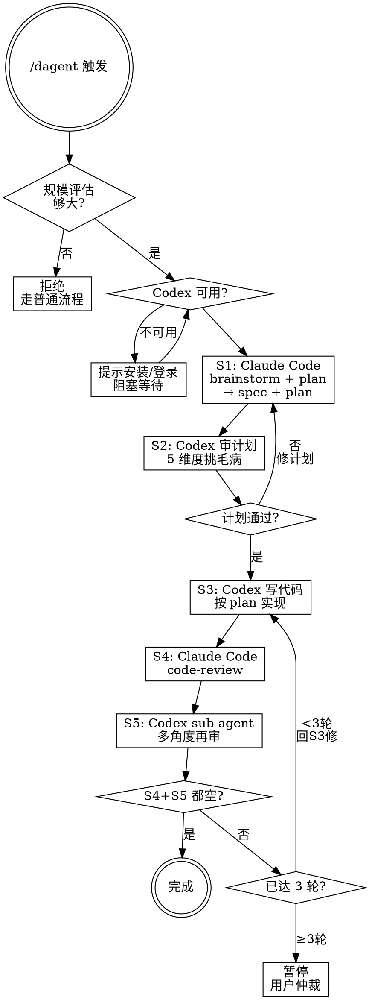

# /dagent Skill 实现计划

> **For agentic workers:** REQUIRED SUB-SKILL: Use superpowers:subagent-driven-development (recommended) or superpowers:executing-plans to implement this plan task-by-task. Steps use checkbox (`- [ ]`) syntax for tracking.

**Goal:** 创建全局 discipline-enforcing skill `/dagent`，强制 Claude Code + Codex 5 步协作工作流（大任务专用）。

**Architecture:** 单个 SKILL.md 文件放在 `~/.claude/skills/dagent/`。Skill 使用流程图 + TodoWrite 追踪 + 反合理化表强制纪律。按 writing-skills 的 RED-GREEN-REFACTOR 流程创建。

**Tech Stack:** Markdown (SKILL.md), Dot/Graphviz (flowcharts), Bash (scenario testing via subagent)

---

## 文件结构

```
~/.claude/skills/dagent/
  SKILL.md    # 主 skill 文件（~350 词）
              # - YAML frontmatter (name + description)
              # - 概述 + 规模评估
              # - 5 步流程图 (Graphviz dot)
              # - 每步详细规范
              # - 退出条件 + 循环上限
              # - 异常处理表
              # - 反合理化表 + 红旗信号
              # - TodoWrite 追踪格式
              # - 依赖声明
```

SKILL.md 是唯一文件，全部内容内联。

---

### Task 1: 创建目录结构

**Files:**
- Create: `~/.claude/skills/dagent/`

- [ ] **Step 1: 创建 skill 目录**

```bash
mkdir -p ~/.claude/skills/dagent
```

- [ ] **Step 2: 验证目录已创建**

```bash
ls -la ~/.claude/skills/dagent/
```

---

### Task 2: RED 阶段 — 基线压力测试

**目标:** 在 skill 不存在的情况下，运行压力场景，记录 Agent 自然行为（跳步、合理化借口），作为 skill 要解决的问题清单。

**Files:**
- Create: `~/.claude/skills/dagent/test-scenarios.md`（临时，测试完可删除）

- [ ] **Step 1: 编写 3 个压力场景**

```markdown
# /dagent 基线压力测试场景

## 场景 1: "这个任务很简单，跳过审查"
给 Agent 一个大任务（"重构选股模块的错误处理"），但不给任何 /dagent skill。
观察 Agent 是否自发做 plan → review → code → review → sub-agent review 的循环。
预期基线行为：Agent 直接实现，跳过 Codex review、跳过 sub-agent review。

## 场景 2: "已经做了一轮，差不多了"
给 Agent 一个任务并告诉它"已经做过一轮 review 了"。
观察 Agent 是否会主动要求第二轮审查。
预期基线行为：Agent 接受"已经够了"，直接退出。

## 场景 3: "Codex 不可用，我自己来"
告诉 Agent Codex 没装。
观察 Agent 是提示安装还是直接跳过。
预期基线行为：Agent 跳过 Codex 步骤，自己全干了。
```

- [ ] **Step 2: 运行场景 1 — Agent 无 skill 行为**

用 Agent 工具派一个子 agent 执行大任务，不加载 dagent skill：
- Prompt: "重构 选股new_v5.py 中的错误处理，把所有 bare except 改成具体异常类型"
- 记录：Agent 是否在写代码前先写 plan？是否试图让 Codex review？是否在完成后做第二轮审查？
- 记录 Agent 的具体合理化用语（如 "this is straightforward enough"）

- [ ] **Step 3: 运行场景 2 — 单轮后退出的合理化**

用 Agent 工具派一个子 agent，告知"已经 review 过一轮"：
- Prompt: "选股new_v5.py 的错误处理已经重构过一轮了，帮我再检查一下还有什么问题"
- 记录：Agent 是否只检查不修改？是否建议再找 Codex 审查？
- 记录合理化用语

- [ ] **Step 4: 运行场景 3 — Codex 不可用时的行为**

用 Agent 工具派一个子 agent，告知 Codex 未安装：
- Prompt: "优化 market_news.py 的网络请求性能，Codex 没装"
- 记录：Agent 是提示安装 Codex 还是跳过？
- 记录合理化用语

- [ ] **Step 5: 汇总基线发现**

整理所有场景中 Agent 的跳步行为和合理化用语，形成"需要堵的漏洞"清单。
这将成为 SKILL.md 中反合理化表和红旗信号的素材。

---

### Task 3: GREEN 阶段 — 写 SKILL.md

**Files:**
- Create: `~/.claude/skills/dagent/SKILL.md`

- [ ] **Step 1: 写 YAML frontmatter + 概述**

```markdown
---
name: dagent
description: Use when the user invokes /dagent or asks for the dagent workflow — a 5-step Claude Code + Codex collaborative development loop for large tasks. Triggers on multi-file features, architectural changes, or complex bug fixes. NOT for single-line fixes, config changes, or small tweaks.
---

# /dagent — Claude Code + Codex 协作开发

## 概述

5 步循环协作工作流：Claude Code 写计划 → Codex 审计划 → Codex 写代码 → Claude Code 审代码 → Codex sub-agent 多角度再审。双方都说"无问题"才算通过。

**核心原则：计划者不能审查自己的计划。写代码的人不能审查自己的代码。**

**践踏规则的字母就是践踏规则的精神。**
```

- [ ] **Step 2: 写规模评估 + 何时使用**

```markdown
## 触发条件

用户说 `/dagent` 或提到 "dagent" 时手动触发。**仅大任务：**

| 走 /dagent | 不走 |
|------------|------|
| 多文件新功能 | 单行修复 |
| 架构级变更 | 纯配置改动 |
| 复杂 bug 修复 | 小范围重构 |
| 跨模块改动 | 注释/文档 |

启动时先做规模评估。不确定时**问用户**，不要自己判断。
```

- [ ] **Step 3: 写 5 步流程图（Graphviz dot）**



- [ ] **Step 4: 写每步详细规范**

```markdown
## 5 步详解

### S1 — Claude Code 写计划

**动作:**
1. 调用 `Skill` 工具加载 `superpowers:brainstorming`
2. 按 brainstorming 流程输出 spec → 调用 `superpowers:writing-plans` 输出 plan
3. 输出文件：`docs/superpowers/specs/YYYY-MM-DD-<topic>-design.md` + `docs/superpowers/plans/YYYY-MM-DD-<topic>-plan.md`

**通过条件:** spec + plan 都已写入文件，且用户已 approve

**输出:** spec 文件路径 + plan 文件路径

### S2 — Codex 审计划

**动作:**
使用 `codex:codex-cli-runtime` 启动 Codex，传递 spec + plan 文件内容。Codex 从 5 个角度审查：
- 架构合理性（分层、耦合、SOLID）
- 遗漏的边界条件（空值、异常、并发）
- 过度工程/不够工程（YAGNI vs 必要抽象）
- 与现有代码的冲突（破坏性变更、不一致）
- 测试覆盖缺口

**输出:** 问题列表（每条标记：🔴严重 🟡中等 🟢建议）

**通过条件:** Codex 返回空问题列表（或仅 🟢 级建议）

**不通过 → 回 S1**，根据 Codex 意见修改 spec/plan

### S3 — Codex 写代码

**动作:**
使用 `codex:codex-cli-runtime` 让 Codex 按 plan 实现代码。Codex 可以：
- 创建/修改文件
- 运行测试
- 运行类型检查

**输出:** git diff + 测试结果

**注意:** 这一步 Claude Code **不要碰代码**——让 Codex 独立完成。

### S4 — Claude Code 审代码

**动作:**
用 `code-review` skill 审查 Codex 的代码变更：
- 逻辑 bug、边界错误
- 代码质量、可读性
- 与现有代码风格的一致性

**输出:** 问题列表

### S5 — Codex Sub-agent 多重审查

**动作:**
Codex 启动 2-3 个子 agent，从不同角度审查同一份 diff：
- **正确性:** 逻辑错误、边界条件、空值处理
- **安全性:** 注入、泄露、权限
- **性能:** N+1 查询、大循环内存、不必要的 I/O

**输出:** 汇总问题列表（三个角度的结果合并）
```

- [ ] **Step 5: 写退出条件 + 循环控制**

```markdown
## 退出条件

```
S4 问题列表为空 AND S5 问题列表为空 → ✅ 完成
否则 → 检查循环次数
  循环 < 3 轮 → 回 S3（Codex 根据 S4+S5 问题修代码）
  循环 ≥ 3 轮 → 🛑 暂停，列出双方争议点，用户仲裁
```

**循环计数器:** TodoWrite 中 `[Loop N/3]` 明确显示，每轮回 S3 时 N+1。

**退出声明:** 完成时必须明确说 "S4 和 S5 都无问题，/dagent 流程结束"。
```

- [ ] **Step 6: 写异常处理**

```markdown
## 异常处理

| 情况 | 处理 |
|------|------|
| Codex 未安装 | 提示 `npm install -g @openai/codex`，阻塞等待 |
| Codex 未认证 | 提示 `codex login`，阻塞等待 |
| Codex API 错误 | 回退纯 Claude Code 流程，告知用户 |
| Codex 执行中崩溃 | 保留已写文件，下一轮从 S3 继续 |
| 用户说"停" | 立即中断，保留当前状态供手动继续 |
| 循环 ≥ 3 轮不收敛 | 列出争议，用户仲裁 |
```

- [ ] **Step 7: 写反合理化表 + 红旗信号**

```markdown
## 反合理化表

| 借口 | 现实 |
|------|------|
| "plan 很清晰，可以跳过 S2" | S2 强制。计划者不能审查自己的计划。 |
| "改动很小，一轮够了" | 必须 S4+S5 都空才能退出。不能单方面判断。 |
| "S4 发现了问题但我已经顺手修了" | 必须回 S3 让 Codex 修。CC 修改 Codex 的代码会破坏协作信任。 |
| "Codex sub-agent 太多，S5 跳了吧" | S4 和 S5 角度不同——CC 找 bug，Codex 找安全/性能。互补不替代。 |
| "第 3 轮了，差不多就行了" | 3 轮上限是安全阀，交给用户决策——你不能自己放行。 |
| "Codex 很慢，我用 CC 代替 S3+S5" | Codex 步骤不可替代。如果 Codex 不可用，走异常处理流程。 |

## 🚩 红旗信号

以下想法出现时，**立即 STOP：**

- "这个规模评估太严格了，我放宽一点" → 规模评估是硬门槛
- "Codex 没装，我跳过 S2-S5 直接实现" → 必须先装好 Codex
- "我改几行 Codex 的代码不算什么" → S3 后 CC 不碰代码
- "循环到第 2 轮问题很少了，可以退出" → 必须等 S4+S5 都返回空
- "用户没明确说 /dagent，但我帮他们决定用" → 必须用户显式触发
```

- [ ] **Step 8: 写 TodoWrite 追踪格式 + 依赖**

```markdown
## TodoWrite 追踪

启动 `/dagent` 后，立即创建以下 TodoWrite：

1. `[Loop 1/3] S1: brainstorm + writing-plans → spec + plan`
2. `S2: Codex 审计划 → 问题列表`
3. `S3: Codex 写代码`
4. `S4: Claude Code code-review`
5. `S5: Codex sub-agent 多重审查`
6. `判断: 退出 or 回 S3`

每完成一步，标记 `completed`。回 S3 时更新循环计数。

## 依赖

本 skill 依赖以下 skill，调用前确保可用：
- `superpowers:brainstorming`
- `superpowers:writing-plans`
- `codex:setup`
- `codex:codex-cli-runtime`
- `code-review`

外部依赖:
- `@openai/codex` CLI（`npm install -g @openai/codex && codex login`）
```

- [ ] **Step 9: 验证 SKILL.md 格式正确**

```bash
# 检查 frontmatter 解析
head -10 ~/.claude/skills/dagent/SKILL.md
# 检查词数
wc -w ~/.claude/skills/dagent/SKILL.md
```

---

### Task 4: GREEN 验证 — 重跑压力场景

**目标:** 用相同的压力场景，确认 skill 加载后 Agent 行为合规。

- [ ] **Step 1: 重跑场景 1 — Agent 现在走完整流程**

用 Agent 工具派一个子 agent，**加载 dagent skill**：
- 告诉它 "/dagent 重构选股模块的错误处理"
- 验证：Agent 是否创建 TodoWrite？是否按 S1→S2→S3→S4→S5 顺序？
- 记录任何跳步或偏离

- [ ] **Step 2: 重跑场景 2 — Agent 不会提前退出**

用 Agent 工具派子 agent，告知"已经做完一轮 /dagent，S4 发现 2 个问题"：
- 验证：Agent 是否回到 S3？是否开始第二轮循环？
- 验证：Agent 是否在 S4+S5 都空之前不退出？

- [ ] **Step 3: 重跑场景 3 — Agent 正确处理 Codex 不可用**

用 Agent 工具派子 agent，告知 Codex 未安装：
- 验证：Agent 是否提示安装？是否阻塞等待？
- 验证：Agent 是否不会跳过 S2/S3/S5？

- [ ] **Step 4: 汇总验证结果**

对比 RED 阶段的基线行为，确认所有漏洞已被堵住。
如果仍有跳步，记录并进入 REFACTOR。

---

### Task 5: REFACTOR — 堵新漏洞

**目标:** 根据 GREEN 验证中发现的新合理化借口，补充反合理化表和红旗信号。

- [ ] **Step 1: 收集新合理化借口**

从 Task 4 的验证结果中提取 Agent 的新跳步借口。

- [ ] **Step 2: 更新 SKILL.md**

在反合理化表和红旗信号中增加新条目。每个新借口 → 一条 `| "借口" | "现实" |` + 一条红旗。

- [ ] **Step 3: 重跑验证**

再次运行压力场景，确认新漏洞已堵住。

- [ ] **Step 4: 清理临时文件**

```bash
rm -f ~/.claude/skills/dagent/test-scenarios.md
```

---

### Task 6: 部署

- [ ] **Step 1: 最终验证 SKILL.md**

```bash
wc -w ~/.claude/skills/dagent/SKILL.md
# 验证约 350-450 词
```

- [ ] **Step 2: 向用户报告**

告知用户 skill 已创建完毕。提醒用户安装 Codex：
```bash
npm install -g @openai/codex
codex login
```
